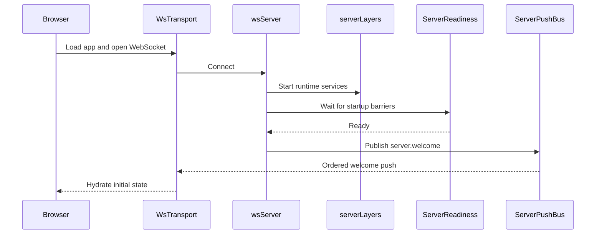
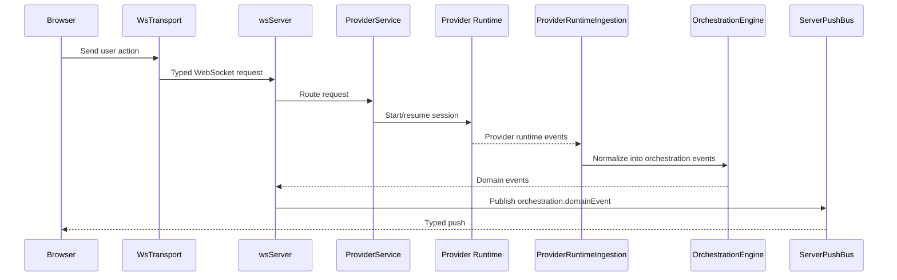
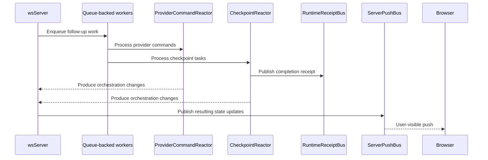

# Architecture

Orchestrate runs as a **Node.js WebSocket server** that wraps provider agent runtimes (Codex, Claude Agent) and serves a React web app.

```
┌─────────────────────────────────┐
│  Browser (React + Vite)         │
│  wsTransport (state machine)    │
│  Typed push decode at boundary  │
└──────────┬──────────────────────┘
           │ ws://localhost:3773
┌──────────▼──────────────────────┐
│  apps/server (Node.js)          │
│  WebSocket + HTTP static server │
│  ServerPushBus (ordered pushes) │
│  ServerReadiness (startup gate) │
│  OrchestrationEngine            │
│  ProviderService                │
│  CheckpointReactor              │
│  RuntimeReceiptBus              │
└──────────┬──────────────────────┘
           │ JSON-RPC over stdio (Codex)
           │ claude-agent-sdk (Claude)
┌──────────▼──────────────────────┐
│  Provider runtime               │
│  (codex app-server / claude)    │
└─────────────────────────────────┘
```

## Target System: Multi-Worker Orchestrator

Most of the orchestrator described below is **planned/in-progress**. The current implementation has basic orchestration with single-thread delegation (a two-option router: answer/delegate, client-side run state, no fan-out).

### Core Objects

**Run** — One user request, owned end-to-end by the root orchestrator from start to completion. Holds goals, constraints, and a spawn budget.

**Task** — A unit of work with objective, dependencies, acceptance criteria, evidence requirements, scope, and owner. Statuses: `pending → assigned → running → submitted → accepted` (with `needs-rework`, `blocked`, `failed`, `cancelled` branches).

**Worker** — A live agent thread assigned to exactly one active task at a time. Carries a `Workspace` (branch, worktree, cwd, terminal IDs, browser session).

**Evidence** — An immutable review artifact captured at a specific point in time. Types: `diff`, `file-snapshot`, `test-result`, `command-result`, `browser-trace`, `screenshot`, `log`, `aria-snapshot`, `computed-style`, `evaluate-result`.

**Decision** — A durable event recording what the orchestrator decided and why. Types: `answered`, `inspected`, `delegated`, `decomposed`, `spawned-worker`, `accepted`, `rejected`, `stuck-detected`, and others.

### Routing Actions

The orchestrator picks one of four actions for every incoming message:

| Action | Description |
|-----------|-------------|
| **answer** | Respond directly from available context — status questions, clarification, reasoning about current evidence. |
| **inspect** | Orchestrator does direct work: reads files, runs commands, operates the browser. Short, bounded, interruptible. |
| **delegate** | Send a bounded task to a worker with an explicit contract: objective, stop condition, read/write scope, allowed tools, evidence requirements, escalation rules. |
| **decompose** | Break the request into a task DAG. Independent tasks may be assigned to parallel workers; dependent tasks are queued. |

Malformed routing output fails safe into `answer`. Capability-classified routing uses an explicit, auditable capability manifest — not prompt lore.

### Delegation Tree (Planned)

- Recursive delegation is supported. A child worker may request child workers within its inherited spawn budget.
- Every spawn is registered and enforced by the root orchestrator, even if triggered by a child.
- A child may only narrow scope, never broaden beyond the parent's authority.
- V1 limits: max delegation depth 3, max children per worker 4, max concurrent writers 4, max total active workers 8.

### Server-Canonical State (Planned)

Runs, tasks, workers, browser sessions, and evidence are all server-owned. The client is a projection/cache only. On reconnect, the server replays run state and the client resumes from last completed step.

Database tables (planned): `projection_orchestrator_runs`, `projection_orchestrator_tasks`, `projection_orchestrator_workers`, `projection_orchestrator_evidence`, `projection_orchestrator_decisions`.

### Evidence-Based Acceptance (Planned)

- Workers mark tasks `submitted`; the root orchestrator marks them `accepted`.
- Every checklist item carries a typed evidence requirement and evidence refs.
- A run completes only when all required tasks are accepted.
- Evidence types map to verification method: `dom` for ARIA/structural checks, `interaction` for click/type/navigate, `computed-style` or `visual` for style and responsive claims.

### Multi-Model Per-Task Selection (Planned)

Model choice is per task, not per run. A worker is bound to one provider/model for the lifetime of one active task. The orchestrator selects providers and models using an explicit policy with capability profiles, fallback rules, and telemetry — not UI dropdowns or prompt lore.

See [provider-architecture.md](provider-architecture.md) for provider details.

### Control-Room UI (Planned)

```
┌─────────────────────────────────────────────────────────────────┐
│ Left Rail          │ Browser Workspace (pinned)    │ Inspector  │
│                    ├───────────────────────────────┤            │
│ • Run tree         │ Worker Panel Canvas           │ • Task     │
│ • Task hierarchy   │ (1-4 live panels, grid)       │ • Evidence │
│ • Active workers   │                               │ • Model    │
│ • Filters          │                               │ • Branch   │
│                    ├───────────────────────────────┤ • Retries  │
│                    │ Orchestrator Transcript        │            │
│                    │ (decisions, chat, timeline)    │            │
└─────────────────────────────────────────────────────────────────┘
```

Left rail: run tree, task hierarchy, active workers, filters. Main top: pinned browser workspace. Middle: worker panel canvas (1–4 live panels, equal grid). Bottom: orchestrator transcript and decisions. Right: inspector for selected task, model policy, evidence, logs, branch/worktree, retries.

---

## Current Implementation

### Components

- **Browser app**: The React app renders session state, owns the client-side WebSocket transport, and treats typed push events as the boundary between server runtime details and UI state.

- **Server**: `apps/server` is the main coordinator. It serves the web app, accepts WebSocket requests, waits for startup readiness before welcoming clients, and sends all outbound pushes through a single ordered push path.

- **Provider runtime**: Provider agents (Codex via JSON-RPC over stdio, Claude via `claude-agent-sdk`) do the actual session work. The server translates runtime events into the app's orchestration model.

- **Background workers**: Long-running async flows such as runtime ingestion, command reaction, and checkpoint processing run as queue-backed workers. This keeps work ordered, reduces timing races, and gives tests a deterministic way to wait for the system to go idle.

- **Runtime signals**: The server emits lightweight typed receipts when important async milestones finish, such as checkpoint capture, diff finalization, or a turn becoming fully quiescent. Tests and orchestration code wait on these signals instead of polling.

### Event Lifecycle

#### Startup and client connect



1. The browser boots [`WsTransport`][1] and registers typed listeners in [`wsNativeApi`][2].
2. The server accepts the connection in [`wsServer`][3] and brings up the runtime graph defined in [`serverLayers`][7].
3. [`ServerReadiness`][4] waits until the key startup barriers are complete.
4. Once the server is ready, [`wsServer`][3] sends `server.welcome` through [`ServerPushBus`][5].
5. The browser receives that ordered push through [`WsTransport`][1], and [`wsNativeApi`][2] uses it to seed local client state.

#### User turn flow



1. A user action in the browser becomes a typed request through [`WsTransport`][1] and [`nativeApi`][12].
2. [`wsServer`][3] decodes that request and routes it to the right service.
3. [`ProviderService`][8] starts or resumes a session and talks to the provider runtime.
4. Provider-native events are pulled back into the server by [`ProviderRuntimeIngestion`][9], which converts them into orchestration events.
5. [`OrchestrationEngine`][10] persists those events, updates the read model, and exposes them as domain events.
6. [`wsServer`][3] pushes those updates to the browser through [`ServerPushBus`][5] on channels defined in [`orchestration.ts`][11].

#### Async completion flow



1. Some work continues after the initial request returns, in [`ProviderRuntimeIngestion`][9], [`ProviderCommandReactor`][13], and [`CheckpointReactor`][14].
2. These flows run as queue-backed workers using [`DrainableWorker`][16], keeping side effects ordered and test synchronization deterministic.
3. When a milestone completes, the server emits a typed receipt on [`RuntimeReceiptBus`][15].
4. Tests and orchestration code wait on those receipts instead of polling git state, projections, or timers.
5. Any user-visible state changes produced by that async work still go back through [`wsServer`][3] and [`ServerPushBus`][5].

[1]: ../apps/web/src/wsTransport.ts
[2]: ../apps/web/src/wsNativeApi.ts
[3]: ../apps/server/src/wsServer.ts
[4]: ../apps/server/src/wsServer/readiness.ts
[5]: ../apps/server/src/wsServer/pushBus.ts
[6]: ../packages/contracts/src/ws.ts
[7]: ../apps/server/src/serverLayers.ts
[8]: ../apps/server/src/provider/Layers/ProviderService.ts
[9]: ../apps/server/src/orchestration/Layers/ProviderRuntimeIngestion.ts
[10]: ../apps/server/src/orchestration/Layers/OrchestrationEngine.ts
[11]: ../packages/contracts/src/orchestration.ts
[12]: ../apps/web/src/nativeApi.ts
[13]: ../apps/server/src/orchestration/Layers/ProviderCommandReactor.ts
[14]: ../apps/server/src/orchestration/Layers/CheckpointReactor.ts
[15]: ../apps/server/src/orchestration/Layers/RuntimeReceiptBus.ts
[16]: ../packages/shared/src/DrainableWorker.ts
